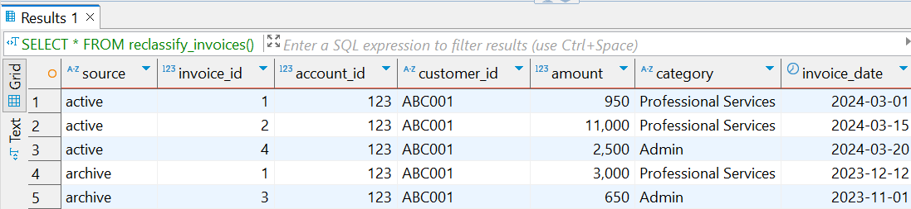

# Finance Reclassification SQL Project

A mock finance SQL project that simulates real-world reclassification and conditional logic in a stored procedure. Built to align with a client use case involving UNION ALL logic, multi-table queries, and finance-related filtering and inserts.

## 🧩 What It Does

- Combines records from `invoices_active` and `invoices_archive` using `UNION ALL`
- Filters by `account_id = 123` and `customer_id = 'ABC001'`
- Reclassifies `'Consulting'` to `'Professional Services'`
- Conditionally inserts a "High Value Notice" row into `invoices_active` if any invoice exceeds `$10,000`

## 📦 Tech Stack

- PostgreSQL (PL/pgSQL)
- DBeaver for DB management
- VS Code for SQL file organization
- GitHub for version control

## 📁 Project Structure

schema/
├── create_invoices_active.sql
├── create_invoices_archive.sql

data/
└── insert_sample_data.sql

procedures/
└── reclassify_invoices.sql

screenshots/
└── demo_result.png

## 🚀 How to Run

1. Create a PostgreSQL database called `finance_demo`
2. Run all `.sql` files in the order shown above
3. Execute the stored function:

```sql
SELECT * FROM reclassify_invoices();
```

4. What happens:

   Any invoice with account_id = 123 and customer_id = 'ABC001' over $10,000 triggers a new row to be inserted into invoices_active

   That inserted row has:

   amount = 100.00

   category = 'High Value Notice'

## ✅ Result Screenshot


